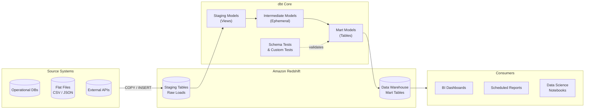
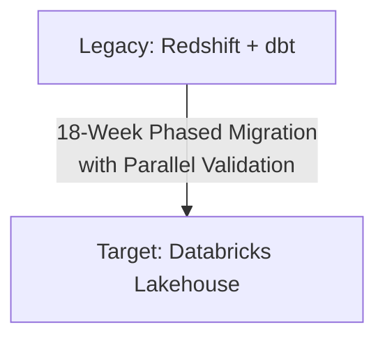
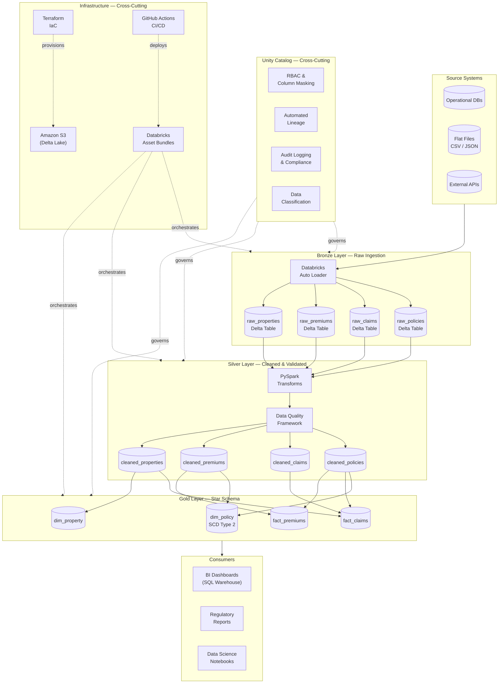

# Redshift/dbt to Databricks Lakehouse Migration Demo

A production-ready reference implementation demonstrating the end-to-end migration of a data warehouse from **Amazon Redshift + dbt** to a **Databricks Lakehouse** architecture on S3, using the medallion pattern (Bronze/Silver/Gold) with Unity Catalog governance.

## Business Context

This project simulates a real-world migration scenario for a property insurance company transitioning from a traditional Redshift data warehouse with dbt transformations to a modern lakehouse architecture. The demo uses a realistic insurance data domain (policies, claims, premiums, properties) to showcase:

- Migrating existing dbt models to Databricks medallion layers
- Preserving data lineage and quality through the transition
- Implementing Unity Catalog governance for regulatory compliance (GLBA, CCPA)
- Running parallel validation between legacy and target environments
- Cost and performance optimization in the new architecture

## Architecture Overview

### Legacy Architecture (Redshift + dbt)



### Migration Path



### Target Architecture (Databricks Lakehouse on S3)



## Repository Structure

```
redshift-to-lakehouse-migration/
│
├── README.md                          # This file
├── MIGRATION_PLAYBOOK.md              # Step-by-step migration strategy
├── .gitignore
├── requirements.txt
│
├── legacy_dbt_project/                # Simulated legacy dbt project
│   ├── dbt_project.yml
│   ├── profiles.yml.example
│   ├── models/
│   │   ├── staging/                   # Staging models (source cleaning)
│   │   │   ├── stg_policies.sql
│   │   │   ├── stg_claims.sql
│   │   │   ├── stg_premiums.sql
│   │   │   └── stg_properties.sql
│   │   ├── intermediate/              # Business logic transforms
│   │   │   ├── int_policy_claims.sql
│   │   │   └── int_premium_summary.sql
│   │   └── marts/                     # Final reporting models
│   │       ├── dim_policy.sql
│   │       ├── dim_property.sql
│   │       ├── dim_coverage.sql
│   │       ├── dim_date.sql
│   │       ├── fact_claims.sql
│   │       └── fact_premiums.sql
│   ├── tests/
│   │   ├── assert_claim_amount_positive.sql
│   │   └── assert_policy_has_property.sql
│   └── macros/
│       └── generate_surrogate_key.sql
│
├── sample_data/                       # Synthetic insurance data
│   ├── generate_sample_data.py        # Data generator script
│   ├── raw_policies.csv
│   ├── raw_claims.csv
│   ├── raw_premiums.csv
│   └── raw_properties.csv
│
├── infrastructure/                    # IaC for target environment
│   ├── terraform/
│   │   ├── main.tf
│   │   ├── variables.tf
│   │   ├── outputs.tf
│   │   ├── s3.tf                      # S3 bucket configuration
│   │   ├── iam.tf                     # IAM roles & policies
│   │   └── databricks.tf             # Databricks workspace config
│   └── unity_catalog/
│       └── setup_catalog.sql          # Unity Catalog DDL
│
├── lakehouse_pipelines/               # Databricks lakehouse implementation
│   ├── bronze/
│   │   ├── ingest_policies.py
│   │   ├── ingest_claims.py
│   │   ├── ingest_premiums.py
│   │   └── ingest_properties.py
│   ├── silver/
│   │   ├── clean_policies.py
│   │   ├── clean_claims.py
│   │   ├── clean_premiums.py
│   │   ├── clean_properties.py
│   │   └── utils/
│   │       ├── schema_validator.py
│   │       └── data_quality_checks.py
│   ├── gold/
│   │   ├── dim_policy.py
│   │   ├── dim_property.py
│   │   ├── dim_coverage.py
│   │   ├── dim_date.py
│   │   ├── fact_claims.py
│   │   └── fact_premiums.py
│   └── orchestration/
│       └── workflow_definitions.json
│
├── migration_validation/              # Parallel run comparison
│   ├── reconciliation.py              # Row count & aggregate comparison
│   ├── schema_comparison.py           # Schema drift detection
│   └── data_diff.py                   # Sample-level record comparison
│
├── data_quality/                      # DQ framework
│   ├── expectations/
│   │   ├── bronze_expectations.py
│   │   ├── silver_expectations.py
│   │   └── gold_expectations.py
│   └── alerting/
│       └── quality_alerts.py
│
├── governance/                        # Compliance & security
│   ├── access_controls.sql            # Unity Catalog RBAC
│   ├── pii_masking.sql                # Dynamic column masking
│   ├── audit_queries.sql              # Access audit queries
│   └── data_classification.md         # Data classification guide
│
├── tests/                             # Unit & integration tests
│   ├── conftest.py
│   ├── test_bronze_ingestion.py
│   ├── test_silver_transforms.py
│   ├── test_gold_models.py
│   └── test_data_quality.py
│
└── docs/
    ├── data_dictionary.md
    ├── er_diagram.md
    └── dbt_to_lakehouse_mapping.md    # Maps dbt models to lakehouse layers
```

## Quick Start

### Prerequisites

- Python 3.10+
- Databricks CLI configured (or Databricks Community Edition for local testing)
- AWS CLI configured (for S3 operations)
- Terraform 1.5+ (for infrastructure provisioning)

### 1. Generate Sample Data

```bash
cd sample_data
pip install -r ../requirements.txt
python generate_sample_data.py --rows 100000 --output-dir .
```

### 2. Review the Legacy dbt Project

```bash
cd legacy_dbt_project
# Explore existing models that will be migrated
cat models/marts/fact_claims.sql
```

### 3. Provision Infrastructure (Optional — for AWS deployment)

```bash
cd infrastructure/terraform
terraform init
terraform plan
terraform apply
```

### 4. Run Lakehouse Pipelines Locally

```bash
# Bronze ingestion
python lakehouse_pipelines/bronze/ingest_policies.py --source sample_data/raw_policies.csv

# Silver transformation
python lakehouse_pipelines/silver/clean_policies.py

# Gold dimensional model
python lakehouse_pipelines/gold/dim_policy.py
```

### 5. Run Migration Validation

```bash
python migration_validation/reconciliation.py --legacy-results legacy_dbt_project/ --lakehouse-results lakehouse_pipelines/
```

### 6. Run Tests

```bash
pytest tests/ -v
```

## Key Migration Patterns Demonstrated

| Pattern | Legacy (dbt/Redshift) | Target (Databricks Lakehouse) |
|---|---|---|
| Raw Ingestion | `COPY` to Redshift staging | Bronze layer: S3 + Delta autoloader |
| Data Cleaning | dbt staging models | Silver layer: PySpark transforms |
| Business Logic | dbt intermediate models | Silver layer: validated & conformed |
| Dimensional Models | dbt marts models | Gold layer: star schema Delta tables |
| Testing | dbt tests + schema tests | Data quality expectations + pytest |
| Documentation | dbt docs | Unity Catalog descriptions + data dictionary |
| Lineage | dbt DAG | Unity Catalog lineage |
| Access Control | Redshift GRANT statements | Unity Catalog RBAC + column masking |
| Orchestration | dbt Cloud / Airflow | Databricks Workflows |
| Version Control | Git + dbt project | Git + Databricks Repos |

## Data Domain: Property Insurance

The sample data models a property insurance business with four core entities:

- **Policies**: Insurance policy records with coverage details, effective dates, and status
- **Claims**: Claims filed against policies with amounts, dates, and resolution status
- **Premiums**: Premium payment transactions tied to policies
- **Properties**: Physical property details including location, construction type, and risk attributes

This domain was chosen because it mirrors the data challenges at insurtech companies: regulatory compliance requirements, geographic risk modeling, temporal data management (policy lifecycles), and high-volume transactional data.

## Technology Stack

| Component | Technology |
|---|---|
| Legacy Warehouse | Amazon Redshift |
| Legacy Transforms | dbt Core |
| Target Storage | Amazon S3 |
| Table Format | Delta Lake |
| Compute Engine | Databricks (Apache Spark) |
| Governance | Unity Catalog |
| Infrastructure | Terraform |
| Pipeline Language | Python (PySpark) + SQL |
| Testing | pytest + custom DQ framework |
| CI/CD | GitHub Actions |

## CI/CD & Deployment Automation

### Architecture

```
Developer → Git Push → GitHub Actions CI → GitHub Actions CD → Databricks
                           │                       │
                           │                       ├─ Terraform Apply (S3, IAM)
                           │                       └─ databricks bundle deploy
                           │
                           ├─ Lint (ruff)
                           ├─ Unit Tests (pytest + PySpark)
                           ├─ Data Generator Validation
                           └─ Terraform Format & Validate
```

### Workflows

| Workflow | Trigger | Purpose |
|---|---|---|
| `ci.yml` | PR to main | Lint, test, validate Terraform |
| `cd.yml` | Merge to main / manual | Deploy infrastructure + pipelines |
| `terraform-plan.yml` | PR with infra changes | Post Terraform plan as PR comment |

### Databricks Asset Bundles

The `databricks.yml` defines all Databricks resources as code:

**Jobs:**
- `medallion_pipeline` — Full Bronze → Silver → Gold pipeline with task dependencies, runs daily at 6 AM ET
- `reconciliation_pipeline` — Parallel-run validation between Redshift and lakehouse (manual trigger)
- `smoke_test_pipeline` — Post-deployment verification of layer access

**Environment Targets:**
- `dev` — Smallest clusters, development catalog, schedule paused
- `staging` — Mid-size clusters, staging catalog, schedule paused
- `prod` — Production clusters with autoscale (2-8 workers), service principal execution, schedule enabled

**Deploy commands:**
```bash
# Validate bundle configuration
databricks bundle validate -t dev

# Deploy to dev
databricks bundle deploy -t dev

# Run a specific job
databricks bundle run medallion_pipeline -t dev

# Deploy to production (requires prod credentials)
databricks bundle deploy -t prod
```

### Pipeline DAG (Databricks Workflows)

```
bronze_ingest_properties ──► silver_clean_properties ──┐
bronze_ingest_policies ────► silver_clean_policies ────┤
bronze_ingest_claims ──────► silver_clean_claims ──────┼──► gold_dim_policy ────┐
bronze_ingest_premiums ────► silver_clean_premiums ────┤   gold_fact_claims ────┼──► data_quality_validation
                                                       │   gold_fact_premiums ──┘
                                                       └──►──────────────────────┘
```

### Required GitHub Secrets

| Secret | Description |
|---|---|
| `AWS_ACCESS_KEY_ID` | AWS IAM access key for Terraform |
| `AWS_SECRET_ACCESS_KEY` | AWS IAM secret key |
| `TF_STATE_BUCKET` | S3 bucket for Terraform state |
| `KMS_KEY_ARN` | KMS key for S3 encryption |
| `DATABRICKS_HOST` | Databricks workspace URL |
| `DATABRICKS_TOKEN` | Databricks personal access token or SP token |
| `DATABRICKS_ACCOUNT_ID` | Databricks account ID |

## License

MIT License — See [LICENSE](LICENSE) for details.

## Author

Brendan — Senior Data Engineer
